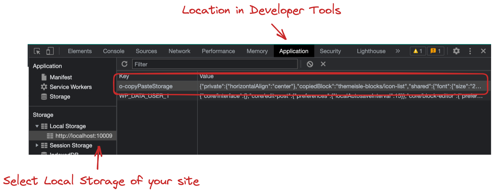

# Copy/Paste Block Style

> a friendly tool for every designer.

A simple plugin allows you to copy/paste a block's style to another. The Block can be an Otter block or a Core block.


## How it works


When you copy a block, the attributes are parsed and translated to a Common Interface named `Storage`. The inverse operation is applied when you paste.

`Storage` has three options:

- **Shared** - values that are sharable among Block: colors, dimensions, typography
- **Private** - unique values that belong to that Block can only be used to the same type. 
- **Core** - values that can be used only by Core blocks.

When adding Copy/Paste for a block, you need to implement two adaptors: one for copy and one for paste.

:warning: This feature heavily relies on Typescript for autocompletion, type compatibility, and modification. When you change the type of an attribute, Typescript will raise an error if there is a problem in the adaptor.

You can see the Common Interface declaration for `Storage` in [`src/block/plugins/models.d.ts`](../src/blocks/plugins/copy-paste/models.d.ts)

Otter adaptors in [`src/block/plugins/adaptors.ts`](../src/blocks/plugins/copy-paste/adaptors.ts)

Core adaptors in [`src/block/plugins/core-adaptors.ts`](../src/blocks/plugins/copy-paste/core-adaptors.ts)

## How to add a block

### Block attributes with Typescript support

You need to have a declaration for block attributes. Most of the blocks are implemented on `types.d.ts` in their folder. Example [Progess Bar](../src/blocks/blocks/progress-bar/types.d.ts).

Then you need to export it, like: 

```Typescript
export type ProgressAttrs = Partial<Attributes>
```

### Making the adaptors

If you do an Otter block, you will use [`Adaptors`](../src/blocks/plugins/copy-paste/adaptors.ts). For Core use [`Core Adaptors`](../src/blocks/plugins/copy-paste/core-adaptors.ts).

An adaptor is a big object where the key is the `name` of the Block from their `block.json` and it has two functions as value: `copy` and `paste`.

Example:

```Typescript
{
    'themeisle-blocks/tabs': {
        copy( attrs: TabsGroupAttrs ): Storage<TabsGroupAttrs> {
            return {
                shared: {
                    colors: {
                        text: attrs?.activeTitleColor,
                        background: attrs?.tabColor,
                        border: attrs?.borderColor
                    },
                    border: {
                        width: makeBox( addUnit( attrs?.borderWidth, 'px' ) )
                    }
                },
                private: {

                }
            };
        },
        paste( storage: Storage<TabsGroupAttrs> ): TabsGroupAttrs {
            const { shared: s } = storage;
            return {
                ...storage.private,
                activeTitleColor: s?.colors?.text,
                tabColor: s?.colors?.background,
                borderColor: s?.colors?.border,
                borderWidth: getInt( getSingleValueFromBox( s?.border?.width ) )
            };
        }
    },
}
```

You can see a symmetry between `copy` and `paste` type declarations. `copy` must take the attributes of the Block and return a `Storage`, and `paste` must take the `Storage` and return the block attributes.

Also, you can see the presence of helper functions like `addUnit` and `makeBox`. Those help us with the translation. Some blocks use only `numbers` for dimensions, while others use `string` composed of numbers and their units (px, rm, rem). 

You can write your helper function but consult with the team not to have five versions of a function that does the same.

:information_source: For Core blocks, we don't have the Typescript definition for their attributes, so we rely on the source file from their Github repo.

We will use `any` and `unknown` for the type definition.

Example

```Typescript
{
'core/group': {

        /**
         *  https://github.com/WordPress/gutenberg/blob/trunk/packages/block-library/src/group/block.json
        */
        copy( attrs: any ): Storage<unknown> {
            return merge( commonExtractor( attrs ),
                {
                    shared: {
                        layout: attrs?.layout
                    }
                }
            );
        },
        paste( storage: Storage<unknown> ): any {
            return merge( commonApplyer( storage ),
                {
                    width: storage.shared?.width?.desktop,
                    layout: storage.shared?.layout
                }
            );
        }
    },
}
```

Adding the link for the source code will be like a gift to the poor soul that it will need to fix it when WP makes some changes.

## Debugging

Under the hood, this feature relies on `localStorage` to store the copied data for cross-tab interaction on the same __browser__ and __host__.

__We do not put anything on the `clipboard`.__

To see the currently copied data, go to the `Application` tab of the Developer Tools in the Browser. Select `Local Storage` and the host URL. ([Guide](https://developer.chrome.com/docs/devtools/storage/localstorage/))

You will see an `o-copyPasteStorage` key, and the content of the `Storage` will be its value.



Every time you copy a block, it will be sync with the storage. 

When things get hard, better use [`debugger`](https://developer.mozilla.org/en-US/docs/Web/JavaScript/Reference/Statements/debugger).

## Good to know

:warning: If you work on a WP instance and want to copy-paste the style to another WP instance, it will not work.

Maybe in the future, we will have this feature. Still, it is very tricky because you need to override the `clipboard` mechanism on how to parse the data and prevent it from conflicting with the Editor - this is a very niche situation; maybe WP will implement something similar in which we can hook ours.
